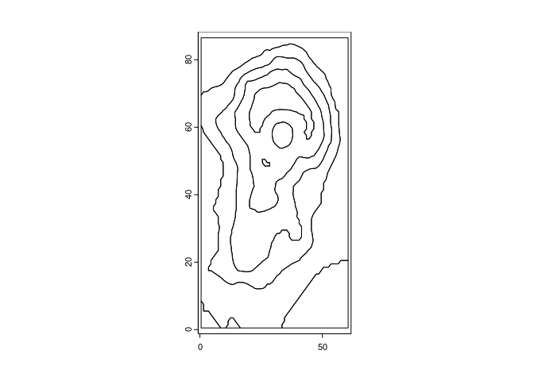
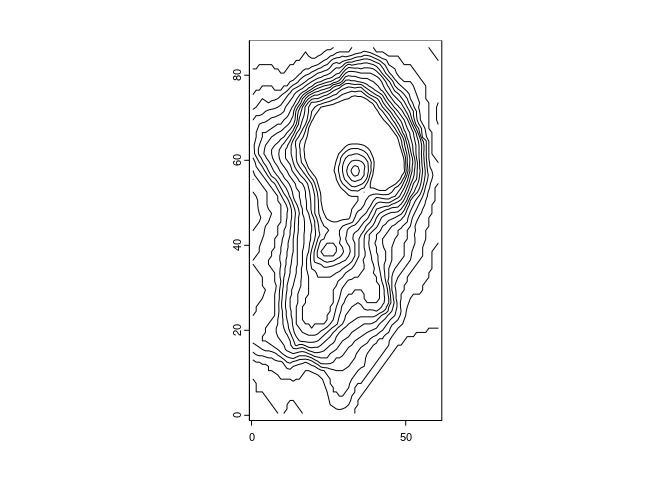
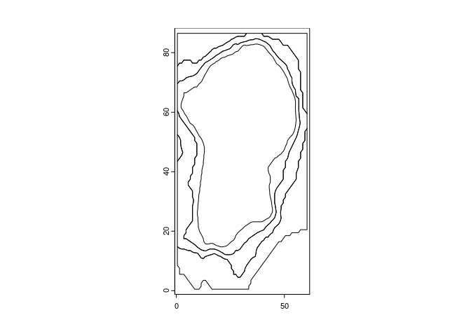
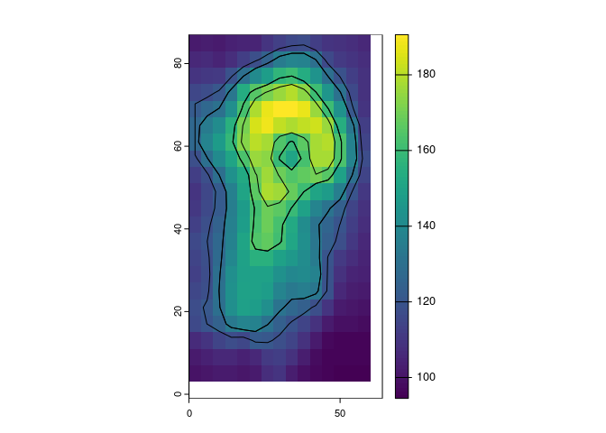

<!-- README.md is generated from README.Rmd. Please edit that file -->

# isoraster

<!-- badges: start -->

[](https://github.com/hypertidy/isoraster/actions/workflows/R-CMD-check.yaml)
<!-- badges: end -->

The goal of isoraster is to create contour lines and contour polygons
from rasters.

The R terra package is used as a foundation. The R isoband package is
the engine, sf is used as an intermediate format internally.

## Installation

You can install the development version of isoraster like so:

``` r
remotes::install_github("mdsumner/isoraster")
```

## Example

This is a basic example.

``` r
library(isoraster)
#> Loading required package: terra
#> terra 1.7.78
```

``` r
plot(isoband_terra(rast(volcano)))
```



``` r

plot(isoline_terra(rast(volcano), seq(100, 170, by = 5)))
```



``` r

plot(isoband_terra(rast(volcano), c(100, 110, 120), c(110, 120, 130)))
```



Note that the lines are nice and smooth, because the underlying
algorithm is marching squares in {isoband}, equivalent to R’s
‘contour()’.

``` r
dr <- aggregate(rast(volcano), 4)
plot(dr)
plot(isoband_terra(dr, c(120, 130, 160), c(130, 160, 170)), add = TRUE)
```



## Code of Conduct

Please note that the isoraster project is released with a [Contributor
Code of
Conduct](https://contributor-covenant.org/version/2/1/CODE_OF_CONDUCT.html).
By contributing to this project, you agree to abide by its terms.
